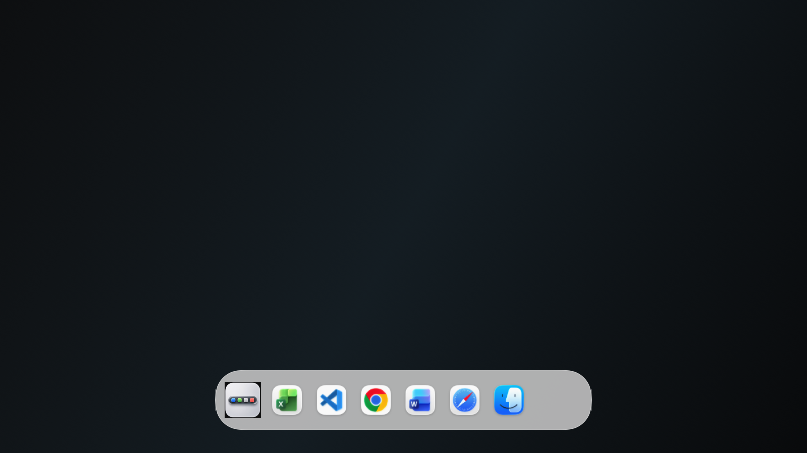

# MoreDock 🧊

MoreDock is a native macOS menu-bar app that adds a Dock-style launcher to every display that does not already have the system Dock.

The goal is simple: keep Apple’s Dock behavior where it already works, and add the missing Dock surface on the rest of your screens.




## Features ✨

- 🖥️ Shows a Dock-style panel on secondary displays.
- 🍎 Hides itself on the screen where the native macOS Dock lives.
- 📐 Follows native Dock settings for edge, tile size, magnification, auto-hide delay, and reveal timing.
- 🔄 Updates while running when `com.apple.dock` preferences change.
- 🧊 Uses a rounded glass pill shape derived from the native Dock tile size.
- 🪟 Can open apps using normal macOS behavior or move app windows to the display whose MoreDock icon was clicked.
- 🔕 Runs as a menu-bar/accessory app, so there is no extra Dock icon.
- 🔄 Includes Sparkle auto-updates plus update checks from the menu bar and Settings.

## How It Works 🧭

When **Follow native Dock** is enabled, MoreDock reads the same Dock preference keys macOS stores in `com.apple.dock`:

- `orientation`
- `tilesize`
- `largesize`
- `magnification`
- `autohide`
- `autohide-delay`
- `autohide-time-modifier`

The app refreshes those values while running, so changes made in System Settings or with `defaults write com.apple.dock ...` are picked up without restarting MoreDock.

By default, **Hide where native Dock lives** is enabled. This prevents MoreDock from drawing on the main/native Dock screen, which avoids duplicate Dock surfaces.

## Window Placement 🪟

The **Open apps on** setting has two modes:

- **macOS**: activate apps exactly like a normal Dock click.
- **Clicked Display**: activate the app, then move its windows to the display where you clicked the MoreDock icon.

Clicked Display uses macOS Accessibility APIs. macOS may ask you to grant MoreDock Accessibility permission before it can move windows.

## Install 📦

Download the latest release:

[Download MoreDock](https://github.com/ArioMoniri/moredock/releases/latest)

Or install with Homebrew:

```sh
brew tap ArioMoniri/moredock https://github.com/ArioMoniri/moredock
brew install --cask moredock
```

## Checksums ✅

Each release includes `SHA256SUMS.txt` next to the `.dmg`, `.zip`, and Sparkle `appcast.xml`.

Verify a downloaded release:

```sh
shasum -a 256 -c SHA256SUMS.txt
```

## Release Notes 📝

See [CHANGELOG.md](CHANGELOG.md).

Latest highlights:

- 🧊 Settings now use a compact native glass layout.
- 🔄 Update checks are available directly inside Settings.
- 📐 Dock sizing and pill shape stay derived from native Dock settings.
- 🖼️ README images are rendered from the real app views.

## Build From Source 🛠️

```sh
./scripts/build_app.sh
```

The app bundle is written to:

```text
.build/MoreDock.app
```

Package locally:

```sh
./scripts/package_release.sh
```
