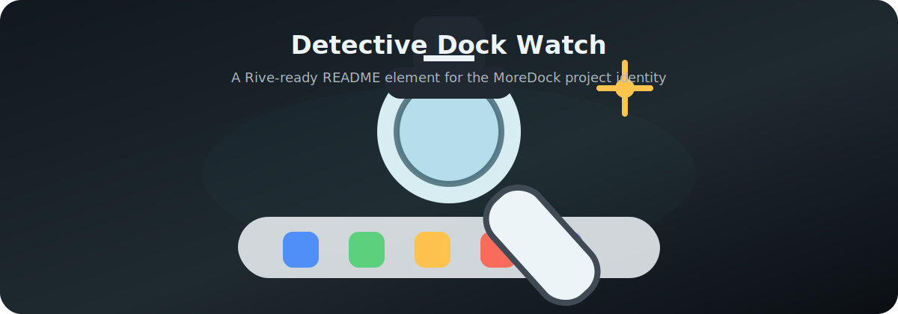

# MoreDock 🧊

MoreDock is a native macOS menu-bar app that adds Dock-style launchers to the displays where macOS does not keep the system Dock.

It follows your real Dock settings, stays out of the main Dock’s way, and runs without adding another icon to the macOS Dock.


## Detective Rive Element 🕵️



[Open the Rive-ready canvas](docs/rive/detective-dock.html)

## What It Does ✨

- 🖥️ Adds Dock panels to extra displays.
- 🍎 Hides on the display that already owns the native macOS Dock.
- 📁 Mirrors pinned Dock apps, running apps, folders, and stacks such as Downloads.
- 📐 Follows native Dock edge, tile size, magnification, auto-hide delay, and reveal timing.
- 🧊 Uses a compact glass panel style with no visible Dock icon for MoreDock itself.
- 🪟 Can move clicked apps to the display where their MoreDock icon was clicked.
- 🔄 Uses Sparkle for signed app updates from GitHub releases.

## Current Release 🚀

Latest release: [MoreDock 0.1.6](https://github.com/ArioMoniri/moredock/releases/latest)

Highlights:

- 📁 Dock folders and persistent Dock apps are included.
- 📏 Dock items shrink to fit the available display edge instead of scrolling.
- ✨ Hidden auto-hide panels are fully transparent and moved outside the screen edge.
- 🎛️ macOS Dock location, size, zoom, magnification, and auto-hide can be edited from MoreDock.
- 🧭 Display-junction avoidance keeps side docks off shared monitor borders by default.
- 🔄 Update checks are available from the menu bar and Settings.

## Install 📦

Download the latest `.dmg`:

[Download MoreDock](https://github.com/ArioMoniri/moredock/releases/latest)

Install with Homebrew:

```sh
brew tap ArioMoniri/moredock https://github.com/ArioMoniri/moredock
brew install --cask moredock
```

## Permissions 🔐

MoreDock only needs Accessibility permission for **Clicked Display** mode.

macOS stores that permission against the exact app bundle and signature. If you switch between local debug builds, unsigned builds, and signed release builds, macOS may ask again. For normal use, install the signed release from the `.dmg`, grant Accessibility permission once, then keep using that installed app.

## Native Dock Matching 📐

When **Follow native Dock** is enabled, MoreDock reads Dock preferences from `com.apple.dock`, including:

- `orientation`
- `tilesize`
- `largesize`
- `magnification`
- `autohide`
- `autohide-delay`
- `autohide-time-modifier`
- `persistent-apps`
- `persistent-others`

Those values refresh while the app is running, so changes made in System Settings are picked up automatically.

MoreDock Settings can also write the native Dock location, size, zoom size, magnification, and auto-hide values back to macOS. Applying those changes restarts the system Dock, which is required for macOS to reload Dock preference changes.

## Window Placement 🪟

The **Open on** setting has two modes:

- **macOS**: activate apps normally.
- **Clicked Display**: activate the app, then move its windows to the display where the icon was clicked.

Clicked Display uses macOS Accessibility APIs. Apps that block Accessibility window movement may still stay on their original display.

## Checksums ✅

Each release includes `SHA256SUMS.txt` for the `.dmg`, `.zip`, and Sparkle `appcast.xml`.

```sh
shasum -a 256 -c SHA256SUMS.txt
```

## Build 🛠️

```sh
./scripts/build_app.sh
```

Package locally:

```sh
./scripts/package_release.sh
```

Release notes live in [CHANGELOG.md](CHANGELOG.md).
