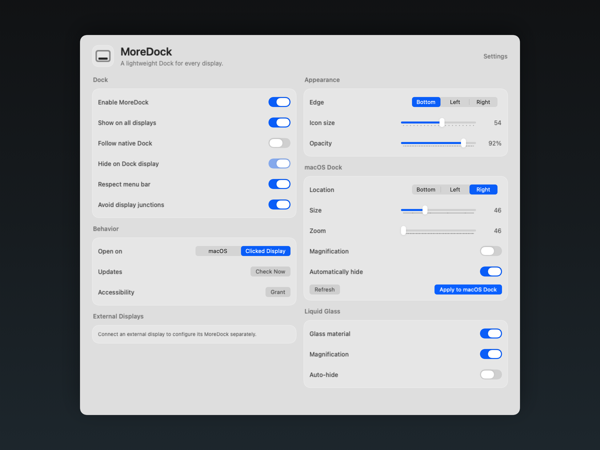

# MoreDock 🧊

MoreDock is a native macOS menu-bar app that adds Dock-style launchers to the displays where macOS does not keep the system Dock.

It follows your real Dock settings, stays out of the main Dock’s way, and runs without adding another icon to the macOS Dock.

<p align="center">
  <a href="https://github.com/ArioMoniri/moredock/releases/latest/download/MoreDock-0.3.0-macOS.dmg">
    
  </a>
</p>



<sub>The **Edge** control shows your actual macOS Dock orientation while *Follow native Dock* is on (this screenshot is illustrative — regenerate it with `swift scripts/render_docs_screenshots.swift` after a UI change).</sub>

## What It Does ✨

- 🖥️ Adds Dock panels to extra displays.
- 🍎 Hides on the display that already owns the native macOS Dock.
- 🧬 Mirrors the native Dock order: Finder, pinned apps, running apps, a separator, folders/stacks (Downloads), and Trash — with running-indicator dots.
- 📐 Follows native Dock edge, tile size, magnification, auto-hide delay, and reveal timing.
- 🧊 Uses a compact glass panel style with no visible Dock icon for MoreDock itself.
- 🪟 Can move clicked apps to the display where their MoreDock icon was clicked.
- 🖱️ Left-click the menu-bar icon to open Settings; right-click for the menu.
- 🟢 Mirrors the macOS Dock's running-app indicator dots (overridable per display).
- 📌 Each dock can keep its **own independent app list** — drag an app onto a dock, use **Add App…** in Settings, or right-click an icon to pin/remove it (choose this dock or all docks).
- 🪵 Built-in Logs window and an Accessibility **Reset** for stale permission entries (Settings ▸ Diagnostics).
- 🔄 Uses Sparkle for signed app updates from GitHub releases.

## Current Release 🚀

Latest release: [MoreDock 0.3.0](https://github.com/ArioMoniri/moredock/releases/latest)

Highlights:

- 📁 Dock folders and persistent Dock apps are included.
- 📏 Dock items shrink to fit the available display edge instead of scrolling.
- ✨ Hidden auto-hide panels are fully transparent and moved outside the screen edge.
- 🎛️ macOS Dock location, size, zoom, magnification, and auto-hide can be edited from MoreDock.
- 🖥️ Every display (including the main one) can be shown/hidden and assigned its own location, size, opacity, auto-hide, magnification, and junction behavior.
- 🧭 Display-junction avoidance keeps side docks off shared monitor borders by default.
- 🖱️ Extra docks no longer depend on which display currently has focus.
- 🔄 Update checks are available from the menu bar and Settings.

## Install 📦

Download the latest `.dmg`:

<p align="center">
  <a href="https://github.com/ArioMoniri/moredock/releases/latest/download/MoreDock-0.3.0-macOS.dmg">
    
  </a>
</p>

Install with Homebrew:

```sh
brew tap ArioMoniri/moredock https://github.com/ArioMoniri/moredock
brew install --cask moredock
```

## Permissions 🔐

MoreDock only needs Accessibility permission for **Clicked Display** mode.

macOS evaluates Accessibility trust **when a process starts**, so enabling MoreDock in the list while it is already running often does not take effect until it is relaunched. The reliable sequence is:

1. In Settings ▸ Diagnostics ▸ **Accessibility**, click **Grant…** and enable MoreDock in Privacy & Security ▸ Accessibility.
2. Click **Relaunch** (next to Grant…) so a fresh copy picks up the grant.

### If it never turns on no matter how often you grant it

This is almost always a **stale Accessibility entry** left by an earlier build or a duplicate copy with the same bundle id — macOS keeps matching the old entry and ignores the new grant. Fix it:

1. Click **Reset** in Settings ▸ Diagnostics ▸ Accessibility. This runs `tccutil reset Accessibility com.ariomoniri.moredock`, clearing every stale entry.
2. Click **Grant…**, enable MoreDock, then **Relaunch**.

You can also run the reset yourself:

```sh
tccutil reset Accessibility com.ariomoniri.moredock
```

Other causes the **Logs** window (Settings ▸ Diagnostics ▸ Logs) makes obvious via the `Signature:` line:

- **Unsigned / ad-hoc builds** (including local `.build` runs) cannot retain the grant — each launch looks like a new app. Use the signed release `.dmg`.
- **Translocated copies** (run straight from a quarantined download) change path each launch. Move MoreDock into `/Applications` first, and delete any other copies (e.g. in `~/Downloads`).

## Native Dock Matching 📐

When **Follow native Dock** is enabled, MoreDock reads Dock preferences from `com.apple.dock`, including:

- `orientation`
- `tilesize`
- `largesize`
- `magnification`
- `autohide`
- `autohide-delay`
- `autohide-time-modifier`
- `persistent-apps`
- `persistent-others`

Those values refresh while the app is running, so changes made in System Settings are picked up automatically.

MoreDock Settings can also write the native Dock location, size, zoom size, magnification, and auto-hide values back to macOS. Applying those changes restarts the system Dock, which is required for macOS to reload Dock preference changes.

## Window Placement 🪟

The **Open on** setting has two modes:

- **macOS**: activate apps normally.
- **Clicked Display**: activate the app, then move its windows to the display where the icon was clicked.

Clicked Display uses macOS Accessibility APIs. Apps that block Accessibility window movement may still stay on their original display.

## Custom App Lists 📌

Every dock mirrors the macOS Dock's pinned apps by default. To give a dock its own list:

- **Drag** an app from Finder onto the dock, or
- Use **Add App…** in Settings ▸ Per-Display Docks, or
- **Right-click** any dock icon and choose *Keep in This Dock* / *Keep in All Docks* / *Remove from This Dock*.

When you add an app, MoreDock asks whether to add it to just that dock or all docks. Once a dock has a custom list it stops mirroring the macOS Dock; press **Reset** in its Settings row to go back to mirroring.

## Checksums ✅

Each release includes `SHA256SUMS.txt` for the `.dmg`, `.zip`, and Sparkle `appcast.xml`.

```sh
shasum -a 256 -c SHA256SUMS.txt
```

## Build 🛠️

```sh
./scripts/build_app.sh
```

Package locally:

```sh
./scripts/package_release.sh
```

Release notes live in [CHANGELOG.md](CHANGELOG.md).

## License 📄

MoreDock is licensed under the [Apache License 2.0](LICENSE).

Copyright © 2026 Ariorad Moniri. See [LICENSE](LICENSE) and [NOTICE](NOTICE) for details.
